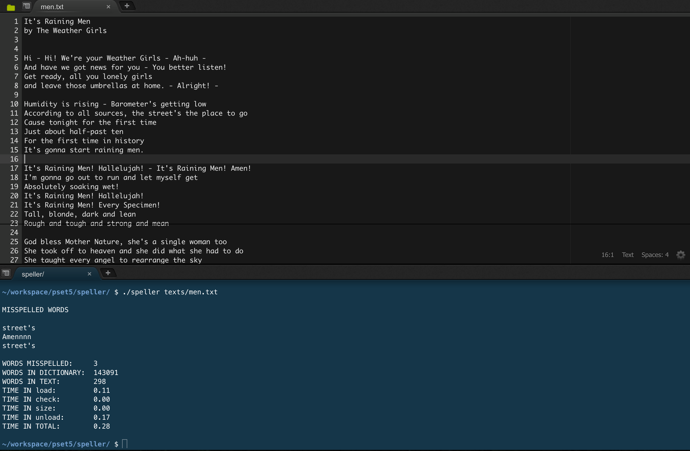
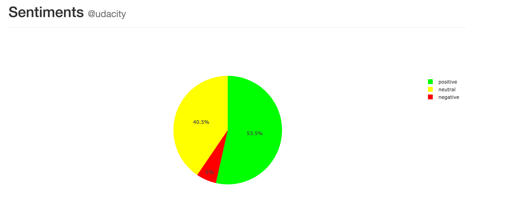
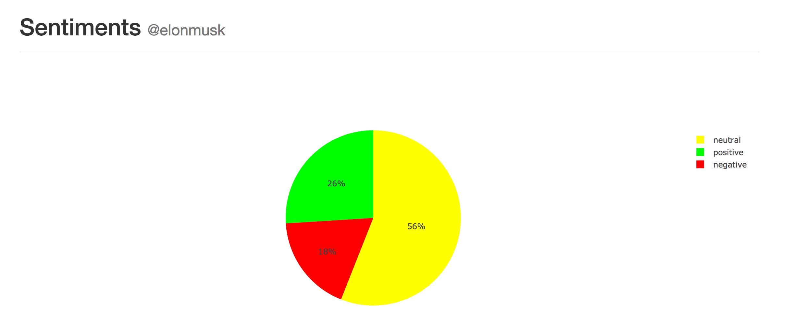
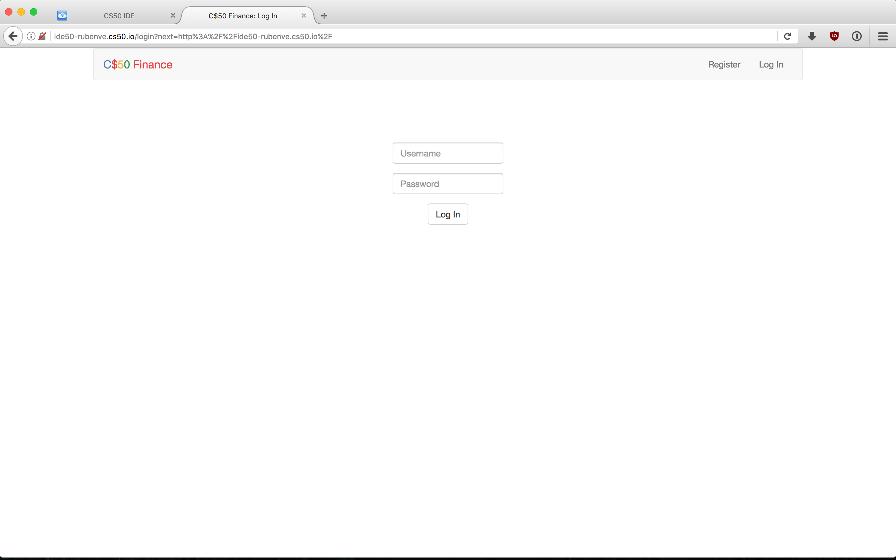
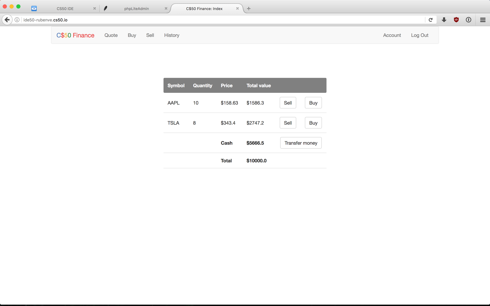
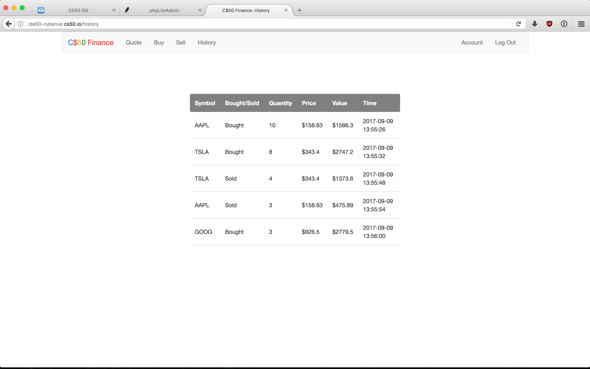
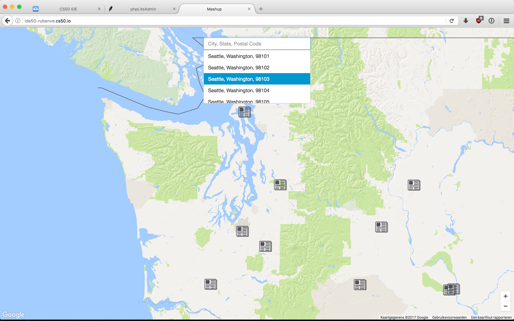

<h3>Final projects for CS50</h3>

<h4>This repository contains my final 4 projects of the CS50 course.</h4>

Every project is a new branch (that's how CS50 automatically saves all of their student's projects):

<strong>x/speller</strong> is a program, written in C, that imports a library and document and spellchecks all the words in the document.

&nbsp;

&nbsp;

<strong>x/pset6</strong> contains multiple (python) programs, the biggest of which (sentiments) analyzes all the tweets of a given user on their 'sentiment' and returns the result in a pie-chart.

&nbsp;

&nbsp;

<strong>x/pset7</strong> is a stock-trading website in which the user can make an account, and 'buy' and 'sell' all kinds of stocks, based on their current price.

&nbsp;

&nbsp;

<strong>x/pset8</strong> is a mashup project in which the user can look up news articles based on a given location.

